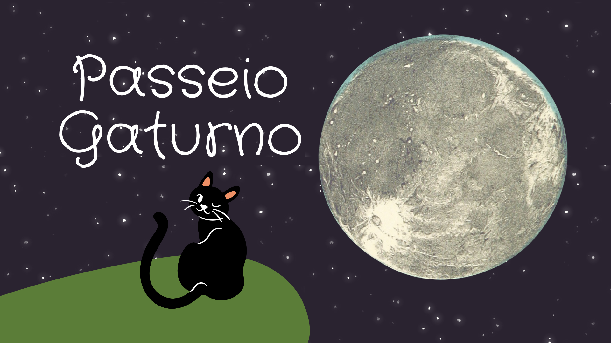

# PasseioGaturno_game_Python

            
        

"print("Bem vindo ao simulador de noites dos gatos, neste jogo você tem como objetivo, perambular pela noite
realizando atividades felinas sem se exaurir e sem se machucar para não ser capturado pelo IBAMA ou falecer!")

  print("Cada ação tem seu custo de energia e cuide da higiene e saúde do seu personagem")
  
  print("Ao selecionar a opção [8 - Voltar para dormir], se o personagem ainda estiver vivo o jogo encerrará")
  
  print('1 - Maju')
  
  print('2 - Cedrico')"
  
